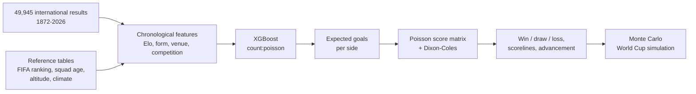

# World Cup Prediction Model

[](https://github.com/zuxu4n/FIFA2026-WorldCupPredictionModel/actions/workflows/ci.yml)

A Python pipeline that forecasts international football matches with a gradient-boosted
Poisson model of expected goals, turns them into score and outcome probabilities with a
Dixon-Coles correction, and simulates the 2026 World Cup bracket by Monte Carlo.

```console
$ wcpred predict --home Canada --away Germany
Canada vs Germany  (East Rutherford, United States, neutral venue; FIFA World Cup, 2026-10-07)
Expected goals:  Canada 0.89 - 1.75 Germany

Canada win    18.2%
Draw          25.0%
Germany win   56.7%

Most likely scores:
  1-1  11.9%
  0-1  11.6%
  0-2  10.9%
  ...
```

The 2026 World Cup finished on 19 July 2026. Every command accepts `--asof DATE` to rerun
the pipeline with only the information available on that date, so the pre-tournament
forecast below can be regenerated exactly.

## Overview



## Engineering highlights

- **Leak-free features, enforced by tests.** One chronological pass stores every team's
  Elo and form *before* each match. Tests check that changing a result never changes
  earlier features, that prediction-time rows are bit-for-bit identical to training rows,
  and that training ignores everything after its cutoff.
- **Point-in-time reproducibility.** The dataset is pinned to an upstream commit and
  SHA-256 verified. Sample weights are anchored to the training cutoff instead of the
  wall clock, and `--asof` replays any past date.
- **Honest evaluation.** Rolling-origin backtest over 6,173 matches. Each fold trains
  only on earlier data, chooses its hyper-parameters inside that window, and is compared
  with two baselines (base rates and an Elo logistic regression).
- **Vectorised simulation.** All Monte Carlo runs advance together as NumPy arrays, with
  one batched model call per round: 10,000 tournaments take 1.8 s, and 1,000 went from
  31.2 s to 0.78 s compared with the original per-match implementation ([benchmark](docs/methodology.md#6-simulation-performance)).
- **Exact tournament rules.** The official 2026 bracket and FIFA's 495-case allocation
  table for third-placed teams are loaded from validated CSVs. A test replays the real
  2026 results and checks that the simulator rebuilds the actual bracket.
- **Package and tooling.** `src/` layout, `wcpred` CLI, typed public interfaces (mypy with
  `disallow_untyped_defs`), Ruff, pytest, and GitHub Actions on Python 3.10 and 3.13.

## Model

1. **What XGBoost predicts.** Each match becomes two rows, one per team. The target is
   the number of goals that team scored. With the `count:poisson` objective the trees
   model the log of the expected goals, which is the natural scale for count data.
2. **Why Poisson.** Goals are rare, roughly independent events, so a team's goal count
   is well described by a Poisson distribution with mean equal to its expected goals
   (lambda).
3. **Score probabilities.** For a fixture the model gives lambda_home and lambda_away.
   Multiplying the two Poisson distributions gives a 13 x 13 matrix of exact-score
   probabilities. Summing below, on and above the diagonal gives home win, draw and
   away win.
4. **Dixon-Coles.** Independent Poisson draws put too little probability on 0-0 and
   1-1 and too much on 1-0 and 0-1. The Dixon-Coles factor reweights only those four
   cells using one parameter, rho, fitted by maximum likelihood on held-out matches
   (rho = -0.071 for the current model). Its measured effect is small (see
   [ablation](docs/methodology.md#5-ablation)).
5. **Knockout ties** add 30 minutes of extra time (a third of each side's expected goals)
   and a 50/50 penalty shootout.

Training: matches since 1990 (32,821), weighted by competition importance and a 6-year
recency half-life. The last 3 years before the cutoff are held out to choose the number
of boosting rounds and fit rho, then the model is refitted on everything.

## Features

| Group | Features | Source |
|---|---|---|
| Elo | team, opponent and difference of pre-match World Football Elo | computed from all 49,945 results |
| Form | goals for/against and points per game over the last 5 and 10 matches, days since last match | results |
| Venue | home, neutral, playing in own country (host advantage) | results |
| Competition | match importance (friendly to World Cup), knockout stage, date | tournament name and schedule |
| Confederation | team and opponent confederation, same-confederation flag | curated |
| FIFA ranking | ranking points as of the match date | [Dato-Futbol/fifa-ranking](https://github.com/Dato-Futbol/fifa-ranking) (to Sept 2024) |
| Squad age | average age of World Cup squads | openfootball squad lists |
| Altitude | venue altitude, team's home altitude, altitude gain | curated, approximate |
| Climate | venue temperature/humidity, heat relative to team's home climate | curated, approximate |
| Market value *(off)* | squad market value | single June 2026 snapshot: leaky, disabled by default |

Each group can be switched with `--include` / `--exclude`. Sources and accuracy are
documented in [`data/README.md`](data/README.md).

## Evaluation

Rolling-origin backtest (`wcpred evaluate`). Each fold's model is trained only on matches
before the fold starts. Log loss is the main metric (lower is better; a uniform guess
scores 1.099).

| Fold | Matches | Log loss | Brier | Accuracy | Elo baseline log loss | Elo baseline accuracy |
|---|---:|---:|---:|---:|---:|---:|
| 2020-21 | 1,471 | 0.836 | 0.490 | 61.8% | 0.842 | 62.3% |
| 2022-23 | 2,034 | 0.885 | 0.521 | 60.2% | 0.889 | 59.9% |
| 2024 to 10 June 2026 | 2,564 | 0.864 | 0.508 | 59.8% | 0.870 | 59.8% |
| World Cup 2026 | 104 | 0.842 | 0.490 | 66.3% | 0.855 | 64.4% |
| **All folds** | **6,173** | **0.864** | **0.508** | **60.5%** | **0.869** | **60.5%** |

How to read this: the model beats a multinomial logistic regression on pre-match Elo in
log loss and Brier score in every fold, but by a small margin, and the two have the same
overall accuracy. Its value is better-calibrated probabilities rather than picking more
winners. International football is noisy: the model's most likely outcome is wrong in
about 40% of matches, and the 104-match World Cup fold is too small to read much into. A random
train/test split would leak future form and Elo into training, which is why every fold
is chronological. Ablations and full details: [`docs/methodology.md`](docs/methodology.md).

## Tournament simulation

`wcpred simulate` plays the rest of the tournament from the current state of the data:

1. Unplayed group matches are sampled from their score matrices; played ones are fixed.
2. Groups are ranked by points, goal difference and goals scored (exact ties broken at
   random; FIFA's head-to-head and fair-play criteria are not modelled).
3. The eight best third-placed teams are slotted with FIFA's allocation table.
4. Knockout matches use advancement probabilities (90 minutes, extra time, penalties)
   at the real venue and date; matches already played are fixed to their real winner.

Pre-tournament forecast (`wcpred simulate --asof 2026-06-11`, 10,000 runs):

| Team | Win group | Reach QF | Reach final | Win World Cup |
|---|---:|---:|---:|---:|
| Spain | 77.6% | 58.8% | 31.5% | 21.9% |
| England | 72.0% | 51.8% | 23.8% | 14.1% |
| France | 57.3% | 50.6% | 21.2% | 12.6% |
| Argentina | 68.8% | 45.3% | 19.2% | 10.7% |
| Netherlands | 55.6% | 38.7% | 11.7% | 5.7% |

Spain went on to beat Argentina 1-0 in the final. That is one outcome of one tournament,
so it says little about whether these probabilities were well calibrated.

## Architecture

```
src/wcpred/
  config.py            paths, pinned data source, tournament rules, feature groups, hyper-parameters
  match.py             MatchContext and match segments (shared domain types)
  data/                results loading and cleaning, reference tables, pinned download
  features/            Elo ratings, chronological feature build, FeatureWorld for new fixtures
  models/              XGBoost goals model, Dixon-Coles score math, rho fitting
  evaluation/          scoring rules and the rolling-origin backtest with baselines
  simulation/          2026 format (groups, bracket, third-place table) and Monte Carlo
  predict.py           Predictor: model + features -> match predictions
  pipeline.py          train / evaluate / simulate steps used by the CLI
  cli.py               `wcpred` command line
scripts/               ablation, benchmark, and reference-data importers
tests/                 unit, property and end-to-end tests (synthetic data, runs offline)
data/                  raw/ (downloaded) and reference/ (committed), see data/README.md
docs/methodology.md    leakage controls, evaluation, ablation, benchmark, changelog
```

## Running locally

Requires Python 3.10+.

```bash
git clone https://github.com/zuxu4n/FIFA2026-WorldCupPredictionModel.git
cd FIFA2026-WorldCupPredictionModel
python -m venv .venv
source .venv/bin/activate        # Windows: .venv\Scripts\activate
pip install -e ".[dev]"

wcpred fetch-data                                   # pinned dataset (~4 MB)
wcpred train                                        # saves artifacts/model/
wcpred evaluate                                     # rolling-origin backtest
wcpred predict --home Canada --away Germany
wcpred predict --home Argentina --away England --knockout --explain
wcpred train --asof 2026-06-11                      # model as of the tournament start
wcpred simulate --asof 2026-06-11 --runs 10000      # pre-tournament forecast
pytest
```

`python -m wcpred ...` works the same as `wcpred ...`. Outputs (CSV/JSON) are written to
`outputs/`.

## Testing

`pytest` runs offline against a seeded synthetic dataset and the committed reference
tables, in well under a minute. It covers:

- data cleaning, tournament weighting and knockout detection (with regression tests for
  the bugs listed in the methodology changelog);
- Elo updates against hand-computed values;
- leakage: earlier features unchanged by later results, train/serve parity, training
  unaffected by post-cutoff data;
- score math: normalisation, Dixon-Coles cells, vectorised vs scalar results,
  advancement probabilities, rho recovery from simulated scores;
- bracket and third-place table validation, including the real 2026 allocation;
- simulation invariants (stage probabilities sum to 32/16/8/4/2/1, monotone per team,
  seeded reproducibility, played results fixed);
- the CLI end to end (train, predict, simulate, `--asof`, error messages).

`tests/test_real_data.py` additionally runs when the pinned dataset is present. CI runs
lint, type checks and tests on every push, plus a job that downloads the real data and
runs the full pipeline.

## Limitations

- Team-level only: no lineups, injuries, suspensions or player data.
- Team strength is frozen at the start of a simulation; simulated results do not update
  Elo or form during the tournament.
- FIFA rankings end in September 2024, so later matches reuse the last snapshot.
- Altitude and climate are hand-curated approximations for 64 teams; other teams and
  venues fall back to defaults. Their measured effect on accuracy is negligible.
- Group tiebreakers beyond goals scored are random rather than FIFA's head-to-head rules.
- Extra time is approximated as a third of a match at the same scoring rates, and
  shootouts as coin flips.
- The tournament format code is specific to the 48-team 2026 World Cup.

## Tech stack

Python, pandas, NumPy, SciPy, XGBoost, scikit-learn (baseline), pytest, Ruff, mypy,
GitHub Actions.
